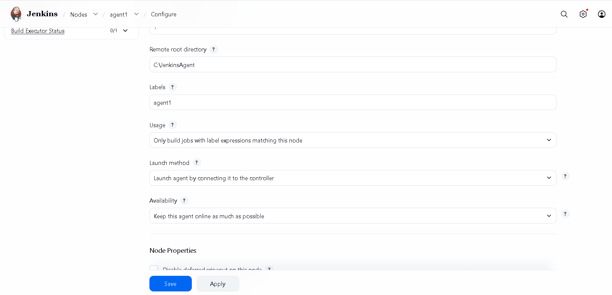
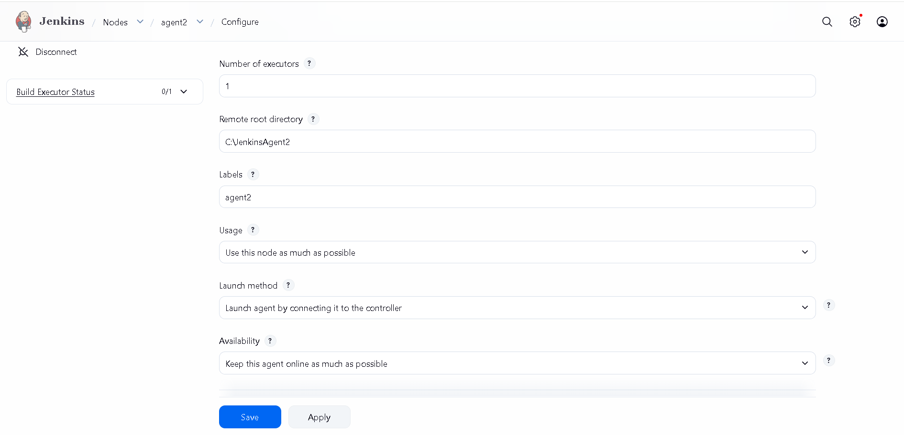
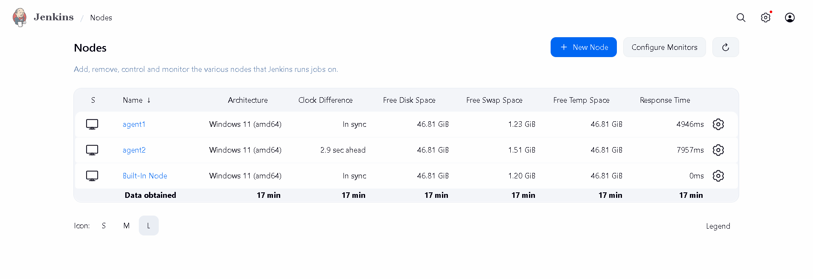

# TASK 2: Jenkins Remoting Project

## Objective

The objective of this task was to understand Jenkins Remoting by configuring a Jenkins Controller and multiple Agent nodes, establishing secure communication between them, and executing build jobs using Jenkins distributed build architecture.

---

## Task Requirements

* Configure Jenkins remoting with remote nodes
* Distribute build workloads securely
* Execute jobs on multiple machines
* Implement node isolation for security
* Gain hands-on experience with Jenkins remote execution

---

## Environment Used

* Jenkins LTS
* OpenJDK 21
* Windows Operating System
* Jenkins Controller
* Jenkins Agent 1 (agent1)
* Jenkins Agent 2 (agent2)
* WebSocket Communication

---

## Project Architecture

```text
Jenkins Controller
│
├── agent1
│    └── Job-Agent1
│
└── agent2
     └── Job-Agent2
```

The Jenkins Controller manages and distributes build tasks to connected agent nodes using Jenkins Remoting over WebSocket.

---

## Implementation

### Step 1: Jenkins Controller Setup

Jenkins LTS was installed and configured successfully on the local machine.

### Step 2: Agent Node Configuration

Two Jenkins agents were created:

* agent1
* agent2

Each agent was configured with its own workspace directory and connected to the Jenkins Controller.

### Step 3: Jenkins Remoting Configuration

Agents were connected using Jenkins Remoting and WebSocket communication.

Example command:

```bash
java -jar agent.jar -url http://localhost:8080/ -secret ******** -name agent1 -webSocket
```

```bash
java -jar agent.jar -url http://localhost:8080/ -secret ******** -name agent2 -webSocket
```

### Step 4: Agent Verification

Both agents successfully connected to the Jenkins Controller.

Connection logs confirmed:

```text
INFO: WebSocket connection open
INFO: Connected
```

### Step 5: Node Isolation Configuration

Node labels were assigned to each agent:

| Agent  | Label  |
| ------ | ------ |
| agent1 | agent1 |
| agent2 | agent2 |

Jobs were restricted to run only on their designated nodes using:

```text
Restrict where this project can be run
```

This ensured workload isolation and prevented jobs from executing on unintended nodes.

### Step 6: Remote Job Execution

Two Freestyle Projects were created:

#### Job-Agent1

Restricted to:

```text
agent1
```

Build Command:

```cmd
echo Running on Agent1
hostname
```

#### Job-Agent2

Restricted to:

```text
agent2
```

Build Command:

```cmd
echo Running on Agent2
hostname
```

Both jobs executed successfully on their respective agent nodes.

### Step 7: Workload Distribution

Build tasks were distributed across multiple Jenkins agents.

* Job-Agent1 executed on agent1
* Job-Agent2 executed on agent2

This demonstrated Jenkins distributed build capabilities.

---

## Screenshots

### Agent 1 Configuration



### Agent 2 Configuration



### Both Agents Online



### Job-Agent1 Configuration


### Job-Agent1 Console Output


### Job-Agent2 Configuration


### Job-Agent2 Console Output


### Build Success


---

## Learning Outcomes

* Understood Jenkins Controller and Agent architecture
* Configured Jenkins Remoting using WebSocket
* Connected and managed multiple Jenkins agents
* Implemented node isolation using labels
* Executed builds on dedicated agent nodes
* Distributed workloads across multiple agents
* Gained practical experience with Jenkins remote execution

---

## Conclusion

This project successfully demonstrated Jenkins Remoting by configuring multiple remote agent nodes, implementing node isolation, distributing build workloads, and executing jobs through Jenkins distributed build architecture.

---

## Author

**Sonal Patani**

DevOps Internship Submission
